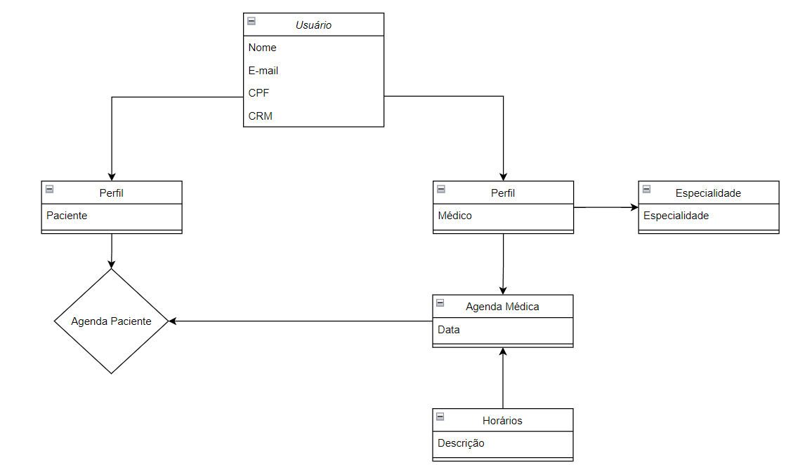

#### [Hackathon - FIAP - Arquitetura de Sistemas com .NET e Azure]
# Health&Med

## Sobre
Health&Med é um sistema para registro de agenda médica e cadastro de consultas.

-----
# Principais funcionalidades do sistema

-----
## Criação de conta
* Para cadastro de conta, o usuário selecioa o tipo de perfil (Médico ou Paciente)

-----
## Autenticação
* O processo de autenticação envolve envio de e-mail e senha pelo frontend.
* Para maior segurança, foi utilizada criptografia de login e senha pelo frontend que é resolvida na controller de autenticação.
  
  

-----
## Cadastro de agenda médica
* Para cadastar agenda, o médico seleciona a data desejada e a lista de horários disponíveis.
* Ao salvar, a agenda é imediatamente atualizada na parte inferior da tela do médico.
* O botão de um horário fica com texto azul indicando agendamento cadastrado por algum paciente.
  

-----
## Agendamento de consulta
* Para cadastrar uma consulta, o paciente seleciona uma especialidade médica que libera a lista de médicos correspondentes.
* Ao selecionar o médico, sua agenda com data e horários são disponibilizados para seleção. 
* Clicando em 'Agendar Consulta', a tabela 'Minhas Consultas' é automaticamente atualizada.

-----

## Notificação de consulta agendada
* Quando um paciente agenda uma consulta, o médico recebe por e-mail a notificação da consulta marcada
  

-----
## API completa do sistema

## Modelagem do banco de dados

-----
## Executar o projeto
* Para executar o projeto, clique com o botão direito no projeto web "HealthMed.Web", selecione "Set as Startup Project" e no botão "executar" na parte superior central, selecione "IIS Express" e clique em executar para carregar a página do Swagger.
* Para executar o Front-End(Angular) utilizando o Visual Studio Code:
    *  Clique em "Open Folder..." e selecione a pasta "HealthMed\HealthMed.Web\ClientApp".
    *  Em seguida no terminal do Visual Studio Code, execute o comando "npm install" para baixar os pacotes.
    *  Por fim "ng serve -o" para executar a aplicação e abrir a página de login.

# Tecnologias utilizadas
* .NET 8
* EntityFrameworkCore
* SQL Server
* Angular 16
